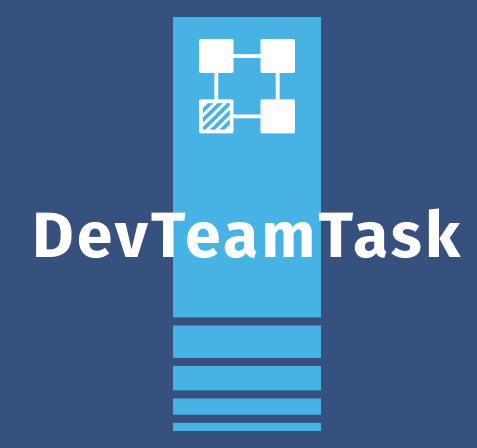

<h1 align="center">
  <br>
  <a href="#"></a>
  <br>
  DevTeamTask
  <br>
</h1>

<h4 align="center">A task management software for development team built on top of <a href="https://www.django-rest-framework.org/" target="_blank">Argparse</a>.</h4>


<p align="center">
  <a href="https://github.com/cookiecutter/cookiecutter-django/">
    
  </a>

</p>

<p align="center">
  <a href="#key-features">Key Features</a> •
  <a href="#how-to-use">How To Use</a> •
  <a href="#credits">Credits</a> •
  <a href="#contact">Contact</a>
</p>


## Key Features

* Authentication
  - With email and password
  - With ddt-token - For users with register by provider
* List projects 
* List task project
* Mark a task as done
* Set project id in cache

## How To Use

To clone and run this application, you'll need [Git](https://git-scm.com), [Python 3.10.6](https://www.python.org/download/) and [Argparse](https://pypi.org/project/argparse/). From your command line:

```bash
# Clone this repository
$ git clone https://github.com/Talismar/devteamtask-cli

# Go into the repository
$ cd devteamtask-cli

# run the project
$ python main.py --help

# Optional
# Create enviroment virtual
$ python3 -m venv venv

# Active enviroment virtual
$ source venv/bin/activate

# install dependencies
$ pip install -r requirements.txt

# run the project
$ python main.py --help
```

## Credits

This software uses the following open source packages:

- [Argparse](https://docs.python.org/3/library/argparse.html)
- [Requests](https://requests.readthedocs.io/en/latest/)
- [Json](https://docs.python.org/3/library/json.html)

## You may also like...

- [DevTeamTask-Backend](https://github.com/Talismar/devteamtask-back) - A task management software for development team
- [DevTeamTask-Frontend](https://gitlab.com/Talismar/devteamtask-front) - A task management software for development team
- [DevTeamTask-Figma](https://www.figma.com/file/93HpbAt9qbG8F41DQERB37/DevTeamTask-%7C-PI-02?type=design&mode=design&t=DoRfhoPhuCJtCq7Q-1) - A task management software for development team


---

## Contact 

> GitHub [Talismar](https://github.com/Talismar)
> Facebook [Tali Fer Costa](https://www.facebook.com/tali.fercosta)
> Gmail [talismar788.una@gmail.com]()
